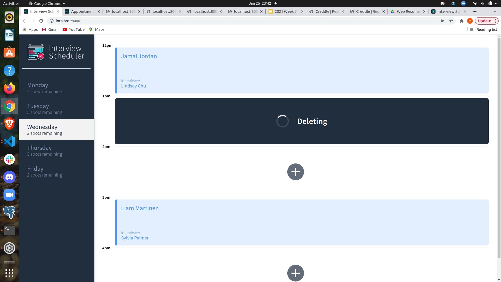

# Interview Scheduler

## Description

Mainly using React alongside with many tools, I manage to build and test a Scheduler application that allows users to book and cancel appointments with interviewers. We combine a concise API with a WebSocket server to build a realtime experience.

## Features

- Application can arrange appointments from Monday to Friday depending on available spots.


- The sidebar constains the days and they show the number of slots available for the day.

- Users can switch between days and get appointment by pressing the empty icon on available hours.


- After creating or deleting appoinments, available spots will be updated accordingly on the app.

- To book a interview its necessary to type a student name and picking an interviewer, otherwise app will throw an error.


- Name or the interviewer on the appointments can be edited later on.


- Existing interviews can also be canceled later on.





- (Extra Screenshots that shows Jest and Cypress tests)


## Setup

Install dependencies with `npm install`.

## Running Webpack Development Server

```sh
npm start
```

## Running Jest Test Framework

```sh
npm test
```

## Running Storybook Visual Testbed

```sh
npm run storybook
```
